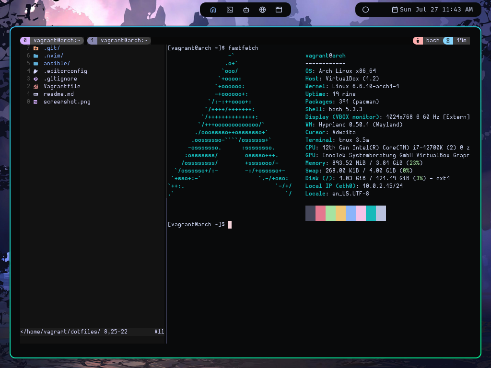

# dotfiles

This is my personal **dotfiles repository**, built for fast, reproducible setups by using **Ansible**, and testable via **Vagrant**.
> 💡 My Neovim configuration is maintained separately here: [pscschn/nvim-385](https://github.com/pscschn/nvim-385)

---



---

## 🔧 Stack Overview

- **Hyprland** as Wayland window manager
- **Neovim** with **Tmux** for terminal-based workflows
- **Ansible**-based provisioning
- **Vagrant**-based testing

## 🎹 Keymaps

Here are some relevant keymaps:

- **Mod + Return** — opens the terminal
- **Mod + Q** — closes the current window
- **Mod + i** — opens the application launcher
- **Caps** - remaped to **Esc**

Here’s the corresponding config snippet from the config:

```ini
bind = $mainMod, RETURN, exec, $terminal
bind = $mainMod, Q, killactive
bind = $mainMod, i, exec, $menu
```

> Note: see all keymaps in the [hyprland.conf](./ansible/roles/dotfiles/templates/hypr/hyprland.conf)

## 🚀 Deployment

### Quick Vagrant Setup

To spin up a test VM with everything prepped:

```bash
vagrant up
```

### Ansible Local Setup

The inventory is setup so ansible deploys to itself by default.

Run the playbook:

```
ansible-playbook \
  -e target_user=<target-user> \
  -i ansible/inventory.yml \
  -e ansible_user=<auth-user> \
  ansible/everything.yml
```

Note: Might need to generate a local SSH key.
